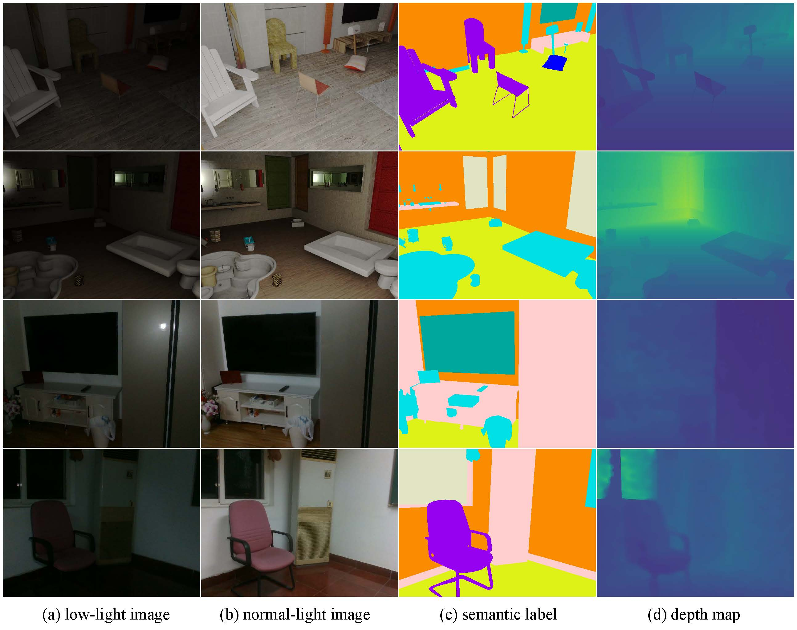

# LISU: Low-light Indoor Scene Understanding

##Authors
Ning Zhang, Francesco Nex, Norman Kerle, George Vosselman

# Introduction
This repository contains the datasets and source code of our framework **LISU**.

LISU is a cascade framework that joinly learns semantic segmentation and reflectance restoration on low-light indoor scenes.

# Dataset: LLRGBD
LLRGBD is a newly collected dataset for low-light indoor scene understanding. It consists
of one large-scale synthetic data set **LLRGBD-synthetic** and one small-scale
real data set called **LLRGBD-real**. We provide pairs of low-light/normal-light images of each scene.

# Usage:
## Download Datasets:
LLRGBD-Real: https://surfdrive.surf.nl/files/index.php/s/EM9sa5DgofvTHdi
LLRGBD-synthetic: https://surfdrive.surf.nl/files/index.php/s/2GvpEMqQ2FVtGpV

## Download checkpoint tarined on LLRGBD-real
https://surfdrive.surf.nl/files/index.php/s/vaWpfQ49nBkauWv

## Evaluation on LLRGBD-real
`python main.py --mode evaluation --data_path /path/to/your/dataset/ --pretrained-model-path /path/to/LISU_LLRGBD_real_best.pth.tar`

## Train on LLRGBD-real
`python main.py --mode evaluation --data_path /path/to/your/dataset/ --pretrained_model_path None`

## Other usages
Please check the code for other usages.

# Citation
If you use our code or datasets please cite:

    @article{zhang2021towards,
    title={Towards Learning Low-Light Indoor Semantic Segmentation with Illumination-Invariant Features},
    author={Zhang, N and Nex, F and Kerle, N and Vosselman, G},
    journal={The International Archives of Photogrammetry, Remote Sensing and Spatial Information Sciences},
    volume={43},
    pages={427--432},
    year={2021},
    publisher={Copernicus GmbH}
    }
    